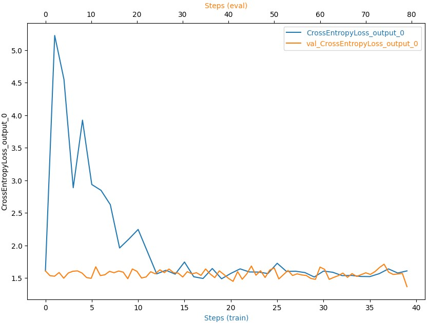

# Object Count Tracking Using AWS Sagemaker

## Project Overview

### Inventory Monitoring at Distribution Centers

Distribution centers often use robots to move objects as a part of their operations. Objects are carried in bins which can contain multiple objects.

In this project, a ML a model was built that can count the number of objects in each bin.

A system like this can be used to track inventory and make sure that delivery consignments have the correct number of items.

This project was build on AWS SageMaker and its services with good machine learning engineering practices to fetch data from a database, preprocess it, then proceed to train, refine, evaluate and validate a machine learning model.

This project will serve as a demonstration of end-to-end machine learning engineering skills that I have learned.

## How it Works

To learn and complete this project. a dataset is needed. I used the [Amazon Bin Image Dataset]("https://registry.opendata.aws/amazon-bin-imagery/"). The dataset contains 500,000 images of bins containing one or more objects. For each image there is a metadata file containing information about the image like the number of objects, it's dimension and the type of object.

The target is to classify the number of objects in each bin.

A pre-trained convolutional neural network architecture was used to train the model using SageMaker notebook instances.

## Process Design

1.Data preparation:

    a. Train data (Fetch, Preprocessing data and Split data into train, test & valid).
    b. Upload the data to S3 container
2.Training:

    a. Hyperparameters tuning.
    b. Train model.
    c. Profile, Debug and model (if there any anomalies and Improve with KPI metrics).
3.Deploy:

    a. Deploy the model.
    b. Test and valid the outcomes.

Here are the tasks you have to do in more detail:

## Setup AWS

1. Create a new Sagemaker Instance notebook with instance type `ml.t2.medium` For free tier or any optimal instance use `ml.m5.large` or `ml.m5.xlarge` higher instance but it will come with a cost.

- Note: While training I used `ml.m5.large` or `ml.m5.xlarge`which comes with a cost. You can use different instance types for this project, but they might require additional permissions to the AWS cloud.

## Download the Starter Files

1. Fork this Github Repo. to your own gitub.
2. Clone your Git repo in Sagemaker Git repo or clone locally in your machine with this line:
`git clone https://github.com/RamyGendy/Object-Count-Tracking-Using-AWS-Sagemaker.git` and upload files manually to Sagemaker
3. Navigate to Starter folder.

## Preparing Data

To build this project you will have to use the [Amazon Bin Images Dataset](https://registry.opendata.aws/amazon-bin-imagery/)

- Download the dataset: Since this is a large dataset, A Json file provided with some code to download a small subset of that data. You are encouraged to use this subset to prevent any excess SageMaker credit usage.
- Preprocess explore, visualize, clean and select the files.
- Upload selected files to an S3 bucket so that SageMaker can use them for training
- OPTIONAL: Verify that the data has been uploaded correctly to the right bucket using the `AWS S3 CLI` or the `S3 UI`

### Data selection

In order to speed up training process only a portion of data was selected from the dataset.

- 1228 images with 1 items in it.
- 2299 images with 2 items in it.
- 2666 images with 3 items in it.
- 2373 images with 4 items in it.
- 1875 images with 5 items in it.

In total 10441 images were used. List of specific files is provided in `file_list.json` file.

Finally, split data into train, test and validation datasets with ratios 60%, 20% and 20% respectively before uploading to S3 Bucket.

### Dataset Sample overview

## Starter Code

Familiarize yourself with the following starter code files

- [`sagemaker.ipynb`](/starter/sagemaker.ipynb) : Main project entiry notebook.
- [`train.py`](/starter/train.py) : Model training script.
- [`hpo.py`](/starter/hpo.py) : hyperparameters tuning script.
- [`inference.py`](/starter/inference.py) : Model inference and deployment script.
- [`file_list.json`](/starter/file_list.json) : contain list of image that will be used in training our model.

## Create a Training Script

details found in `train.py` script.

- Install necessary dependencies
- Read and Preprocess data: Before training your model, you will need to read, load and preprocess your training, testing and validation data
- Train your Model: it will take about ~20 mins per job with low cost selected instance.
- Note: in the [Standout Suggestions](#standout-suggestions) section we can see how to reduce cost or train faster on multi-instance.

## Hyperparameter tuning

Before training it is preferred to find the best hyperparameters for the training job. `hpo.py` python script which executes one epoch of training and tests the hyperparameter ranges:

    - Learning rate range : 0.001, 0.1
    - Batch size values   : 32, 64, 128, 256, 512

## Train using SageMaker

Found in in the `sagemaker.ipynb` notebook

- Setup the training estimator
- Submit the job
- Profile, Debug and model (if there any anomalies and Improve with KPI metrics).
For this project Cross Entropy Loss Output was the metric

## Model Deployment

Once you have trained your model, check the metrics and see if the results satisfying then deploy the model to a SageMaker endpoint where we will be able to query it with a test image to get a prediction.

## Model Inference Test & Evaluation

Once Successful deplyment, we can run a test image like this to see our model prediction.

There are `3` items in this bin so it is expected from the model to give us `3` as an answer.

The model answer is: `3`

## Standout Suggestions

- **Hyperparameter Tuning:** To improve the performance of your model, can you use SageMaker’s Hyperparameter Tuning to search through a hyperparameter space and get the value of the best hyperparameters.
- **Reduce Costs:** To reduce the cost of your machine learning engineering pipeline, you do a cost analysis and use spot instances to train model and delete endopoint after training.
- **Multi-Instance Training:**  you train the same model, but this time distribute your training workload across multiple instances. (for details on how distribute training and workloads across multiple instances check my other detailed [project](https://github.com/RamyGendy/MLOps-Operationalizing-AWS-ML-Project)).
